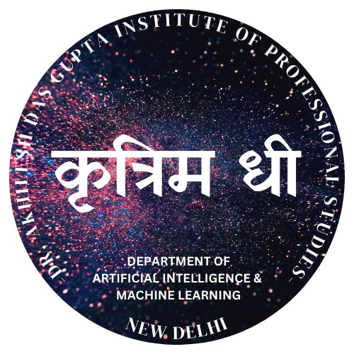

#  Kritrim Dhi - Official AIML Society  

## 🚀 About Us  
**Kritrim Dhi** is the official **AI & Machine Learning society**, driven by passionate students eager to explore the frontiers of technology. Our goal is to bridge the gap between **theoretical knowledge** and **real-world applications** by fostering a culture of research, innovation, and collaboration.  

We provide an interactive platform for students to work on **cutting-edge projects**, participate in **hackathons**, and contribute to **open-source initiatives**. Our community believes in **learning by doing**, encouraging members to work on AI models, web applications, and groundbreaking tech solutions.  

Through workshops, mentorship programs, and industry collaborations, **Kritrim Dhi** empowers students to develop skills that extend beyond textbooks, preparing them for careers in **AI, ML, software development, and research**. Whether you're a beginner or an experienced coder, we offer a space to **learn, innovate, and grow together**.  

## 🌍 Our Mission  
- Promote **research and development** in emerging technologies.  
- Advance **AI/ML applications** through hands-on projects and competitions.  
- Enhance **tech & web development** skills through practical workshops and hackathons.  

## 🎯 Departments  

### 🔬 Research & Development (R&D)  
- Encourages students to explore cutting-edge technologies.  
- Facilitates research-based projects and publications.  
- Organizes ideation challenges and innovation sprints.  

### 🤖 AI/ML (Artificial Intelligence & Machine Learning)  
- Focuses on AI/ML research and real-world applications.  
- Conducts coding sessions, Kaggle competitions, and AI-based projects.  
- Provides mentorship in deep learning, NLP, and computer vision.  

### 💻 Tech & Web Development  
- Develops websites, apps, and tech solutions for real-world problems.  
- Explores full-stack development, cloud computing, and DevOps.  
- Conducts coding boot camps, hackathons, and open-source contributions.  

## 💌 Connect with Us  
🔗 LinkedIn: [Kritrim Dhi LinkedIn](https://www.linkedin.com/company/kritrimdhi/)  
📸 Instagram: [Kritrim Dhi Instagram](https://www.instagram.com/kritrim.dhi)  
🎓 Medium: [Kritrim Dhi Medium](https://medium.com/@kritrimdhi)  
👨‍💻 Dev.to: [Kritrim Dhi Dev.to](https://dev.to/kritrim_dhi)  

---

